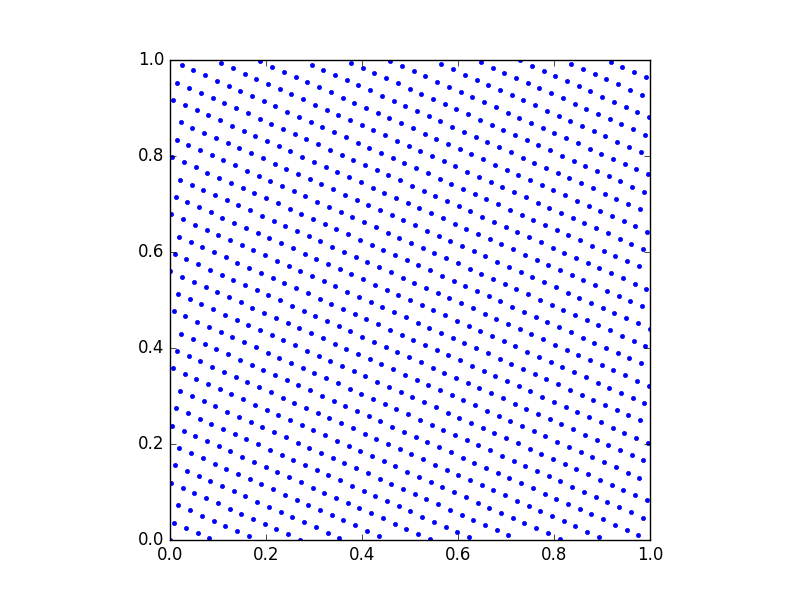
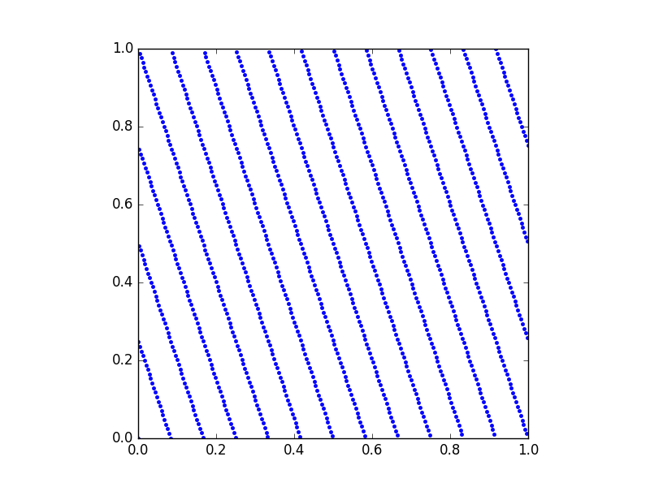

# The QMC module for Julia

This module provides an implementation of some standard Quasi-Monte Carlo (QMC) point set generators.
Currently, only rank-1 lattice rules and randomized rank-1 lattice rules in base 2 are supported.

The module generates quasi-random points in `s` dimensions that are distributed *better than random*.
These points are used in [Quasi-Monte Carlo methods](https://en.wikipedia.org/wiki/Quasi-Monte_Carlo_method) to speed up 
the convergence of traditional [Monte Carlo methods](https://en.wikipedia.org/wiki/Monte_Carlo_method).

## Rank-1 lattice rules

QMC methods are equal-weight cubature rules to approximate high-dimensional integrals over the unit cube `[0,1]^s`. For rank-1 lattice rules, the quadrature points are chosen as multiples of a deterministic *generating vector* `z`, mapped back to the unit cube by taking the `mod 1`. The typical best convergence that can be achieved using these lattice rules is `O(N^−1)`, where `N` is the number of points.

Note that our lattice rules are in fact (32-bit extensible) lattice sequences, since we apply a *radical inverse* reordening to every point in the sequence. By doing this, the total number of points doesn't need to be known in advance.

## Installation

Save a local copy of the QMC-folder and add the module to your `~/.juliarc.jl`-file, i.e., append the following line:
```julia
push!(LOAD_PATH,"/Path/to/QMC/src")
```

## Usage

Now you should be able to 
```julia
use QMC
```

A lattice sequence in `s = 2` dimensions can be constructed as
```julia
lat = LatSeq(2)
```

The first point of the sequence
```julia
next!(lat)
```
is a `Vector{Float64}` of length `s`:
```
[0.0, 0.0]
```

We can also ask for multiple points at once, using the second argument, i.e.,
```julia
next!(lat,10)
```

The next 10 points of the sequence are
```
[0.5,0.5]      
[0.75,0.25]    
[0.25,0.75]    
[0.375,0.125]  
[0.875,0.625]  
[0.625,0.875]  
[0.125,0.375]  
[0.1875,0.0625]
[0.6875,0.5625]
[0.9375,0.3125]
```

We provide two different generating vectors `z`:

* the `250`-dimensional generating vector from Cools, R., Kuo, F. Y., and Nuyens, D., "Constructing embedded lattice rules for multivariate integration." *SIAM Journal on Scientific Computing* 28.6 (2006): 2162-2188
* a `3600`-dimensional generating vector with product weights `1/j^2` from [Kuo's website](http://web.maths.unsw.edu.au/~fkuo/lattice/)

Depending on the size of `s`, a suitable generating vector is used. If needed, the user can supply their own generating vector with
```julia
lat = LatSeq(z,s,nmax)
```
where `nmax` is the maximum number of points in the sequence.

## A simple example

Let's set up a simple lattice sequence and investigate the projection of certain dimensions.
First, construct a lattice sequence and generate some points:
```julia
using PyPlot

lat = LatSeq(10) # 10-dimensional lattice sequence
points = next!(lat,1024)
```
Next, we plot dimension `9` against dimension `4`:
```julia
points = hcat(points...)' # to "flat" array
figure(1), subplot(111,aspect="equal")
plot(points[:,9], points[:,4], "b.") # a good projection
```

This is a good projection, since the points distribute the space `[0,1]^s` evenly. Next, look at the projection of dimension `6` against dimension `2`:
```julia
points = hcat(points...) # to "flat" array
figure(2), subplot(111,aspect="equal")
plot(points[:,6], points[:,2], "b.") # a bad projection
```

Now, we clearly see a pattern in the distribution of the lattice points. Other bad (but nice) projections are `1` versus `9`, `8` versus `5` or `10` versus `4`.
